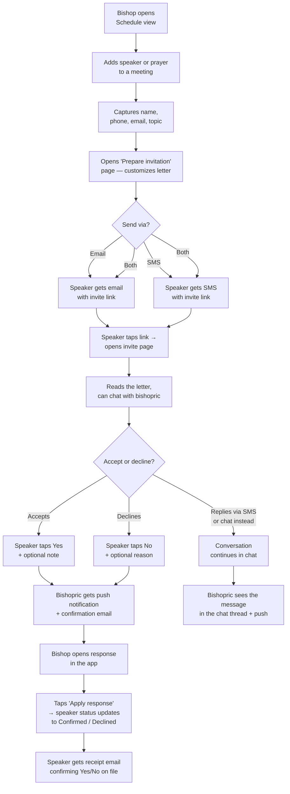
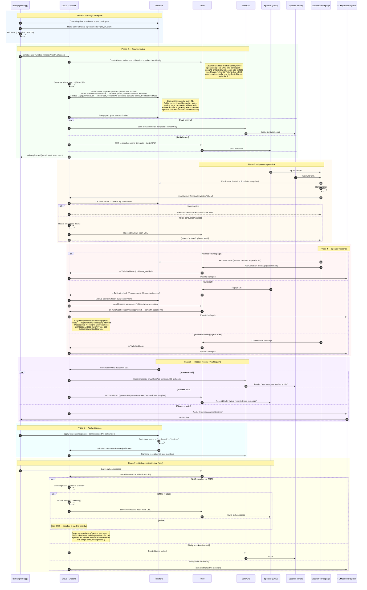

# Speaker / Prayer Invitation Flow

This doc traces the end-to-end flow for inviting a speaker or prayer to a sacrament meeting — from the moment a bishopric member adds them to a meeting, through delivery (email + SMS + web chat), the speaker's response, and the receipts that fan back to the bishopric.

It holds two diagrams at different altitudes:

- **[Bishopric flow](#bishopric-flow)** — high-level, suitable for sharing with the bishopric.
- **[Engineering sequence](#engineering-sequence)** — full lanes (Cloud Functions, Twilio, SendGrid, Firestore, FCM) for contributors and review.

Speaker invitations and prayer invitations follow the *same* flow — the same Cloud Functions, the same capability-token model, the same Twilio Conversation. The only differences are template keys (`speakerLetter` vs `prayerLetter`, etc.) and a handful of UI strings.

---

## Bishopric flow

### Walkthrough

1. **Assign.** From the Schedule view a bishop adds a speaker or prayer participant to a Sunday meeting and captures their contact info (and topic, for speakers).
2. **Prepare.** The bishop opens a "Prepare invitation" page that loads the ward's letter template into a WYSIWYG editor. The bishop can tweak the letter for this specific person before sending.
3. **Send.** The bishop chooses Email, SMS, or both. The speaker receives a personalized message with a one-tap invite link.
4. **Speaker reads + chats.** The link opens a public web page showing the letter. The speaker can chat back-and-forth with the bishopric directly on the page, or reply by SMS — both feed the same thread.
5. **Speaker responds.** The speaker either taps Yes/No on the page (with an optional note) or just sends a reply by SMS / chat. Either way the bishopric is notified.
6. **Apply.** The bishop opens the response in the app and taps "Apply" to lock the participant's status to Confirmed or Declined. The speaker gets a receipt email confirming what's on file.

---

## Engineering sequence

---

## Source files by phase

| Phase | File |
|------|------|
| Bishop assigns speaker | [src/app/routes/assign-speaker/AssignSpeakerPage.tsx](../src/app/routes/assign-speaker/AssignSpeakerPage.tsx) |
| Bishop assigns prayer | [src/app/routes/assign-prayer/AssignPrayerPage.tsx](../src/app/routes/assign-prayer/AssignPrayerPage.tsx) |
| Bishop prepares letter (speaker) | [src/app/routes/prepare-invitation/PrepareInvitationPage.tsx](../src/app/routes/prepare-invitation/PrepareInvitationPage.tsx) |
| Bishop prepares letter (prayer) | [src/app/routes/prepare-prayer-invitation/PreparePrayerInvitationPage.tsx](../src/app/routes/prepare-prayer-invitation/PreparePrayerInvitationPage.tsx) |
| Send invitation (callable) | [functions/src/sendSpeakerInvitation.ts](../functions/src/sendSpeakerInvitation.ts) → [functions/src/freshInvitation.ts](../functions/src/freshInvitation.ts) |
| Email + SMS delivery | [functions/src/invitationDelivery.ts](../functions/src/invitationDelivery.ts) |
| Speaker invite page | [src/app/routes/invite-speaker/SpeakerInvitationLandingPage.tsx](../src/app/routes/invite-speaker/SpeakerInvitationLandingPage.tsx) |
| Token exchange | [functions/src/issueSpeakerSession.ts](../functions/src/issueSpeakerSession.ts) |
| Speaker writes Yes/No, bishop applies | [src/features/invitations/utils/invitationActions.ts](../src/features/invitations/utils/invitationActions.ts) |
| Receipt emails + response push | [functions/src/onInvitationWrite.ts](../functions/src/onInvitationWrite.ts), [functions/src/invitationResponseNotify.ts](../functions/src/invitationResponseNotify.ts) |
| Twilio reply webhook (Conversations + Messaging) | [functions/src/onTwilioWebhook.ts](../functions/src/onTwilioWebhook.ts) |
| Inbound SMS → chat relay | [functions/src/twilio/inboundSmsRelay.ts](../functions/src/twilio/inboundSmsRelay.ts) |
| Doc-split helpers (parent + auth subdoc reads/writes) | [functions/src/invitationDocs.ts](../functions/src/invitationDocs.ts) |
| Migration: fold private fields off existing parents | [scripts/migrate-invitation-doc-split.ts](../scripts/migrate-invitation-doc-split.ts) |

---

## Storage shape — public parent vs private auth subdoc

Two Firestore docs back every invitation, written atomically at send
time. The public parent stays world-readable so the speaker landing
page renders without auth; the private subdoc is gated by Firestore
rules.

**Public parent** at `wards/{wardId}/speakerInvitations/{id}` — letter
snapshot fields (`speakerName`, `assignedDate`, `wardName`,
`inviterName`, `bodyMarkdown`, `footerMarkdown`, `editorStateJson`,
`speakerTopic`, `kind`, `prayerRole`, `speakerRef`), `expiresAt`,
`createdAt`, `conversationSid`, `currentSpeakerStatus`, plus a tiny
`responseSummary` (`answer` + `respondedAt`) so the pre-auth banner
can switch out of "tap Yes/No" mode without reading the private
subdoc.

**Private auth subdoc** at `wards/{wardId}/speakerInvitations/{id}/private/auth` —
sensitive state: `tokenHash`, `tokenStatus`, `tokenExpiresAt`,
`tokenRotationsByDay`, `speakerEmail`, `speakerPhone`,
`bishopricParticipants` (with email), the full `response` object
(`reason`, `actorUid`, `actorEmail`, `acknowledgedAt`,
`acknowledgedBy`), `speakerLastSeenAt`, `fromNumberMode`,
`deliveryRecord`. Read-allowed for the speaker only after
`issueSpeakerSession` mints a Firebase custom token with matching
`invitationId` + `wardId` claims, OR for an active bishopric/clerk.
Update is even tighter — see [firestore.rules](../firestore.rules).

The merged `SpeakerInvitation` shape callers consume is built by
loading both halves: server callers go through `invitationDocs.ts`'
`loadMergedInvitation` / `loadMergedInvitationByConversation`; client
hooks (`useSpeakerInvitation`, `useLatestInvitation`) subscribe to
both and merge in component state. Closes the C1 finding from the
2026-05-01 security audit.

---

## Intentionally simplified out

The diagrams omit a few branches that exist in the code but would clutter the picture. Pointers for when you need them:

- **Quiet hours / timezone filtering on FCM pushes** — applied per-recipient inside `notifyBishopricOfResponse` and the reply-push helpers.
- **Per-template variable interpolation** (`{{speakerName}}`, `{{topic}}`, `{{wardName}}`, …) — handled by `messageTemplates.ts` in `functions/src/`.
- **Speaker vs prayer template keys** — every notification lookup branches on `kind` to pick the right template (e.g. `speakerResponseAccepted` vs `prayerResponseAccepted`). Parity was finished in commit `8660a98`.
- **Twilio Conversation cleanup on re-send** — `freshInvitation.ts` deletes any prior Conversation for the same (ward, speaker, meeting) before creating a new one.
- **Why the speaker has no SMS-only Conversations participant** — Twilio's chat → SMS auto-broadcast would echo the speaker's web-side replies back to their own phone, and double-up on bishop chat replies (since `smsSpeaker` already drives outbound server-side). The relay model avoids both. The proper Twilio fix (`MessagingBinding.ProjectedAddress`) is gated by account authorization (error 50439); revisit if/when granted. See #227.
- **Token rate-limit response** — when a speaker burns through the 3/day rotation cap, `issueSpeakerSession` returns `{ status: "rate-limited" }` and the invite page tells them to contact the bishopric.
- **iOS WebView `mintWebSession` branch** — `issueSpeakerSession` mints an extra session shape when called with `mintWebSession: true` from the iOS app.
